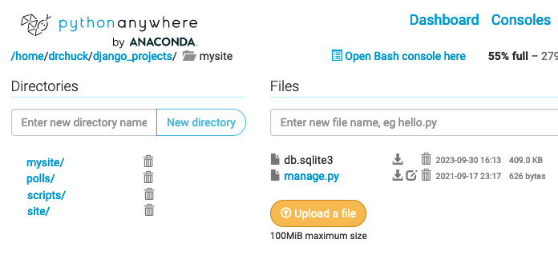

Batch Loading a Data Model
==========================

Sometimes, we need to build a Django model and pre-load it with data from a file or other
source.

In this assignment, we are going to build a `book` model and load data from a CSV file.
Our book model will be a simpler version of the one used in the lectures in the class.
Our data file will have book titles and languages separated by a commas.

    # https://www.nypl.org/blog/2020/12/03/125-nyc-books-we-love-multilingual-titles
    The Age of Innocence,en
    The Age of Innocence,es
    Another Country,en
    Another Country,es
    Another Country,iw
    Bodega Dreams,en
    Bodega Dreams,es
    ...

You can download the data for this assignment at <a href="dj4e_book.csv" target="_blank">dj4e_book.csv</a>.

You can parse the rows with the `csv` library or `split(',')`.  

Before You Start Any Assignment
-------------------------------

Before you start any assignment, make sure your bash shell has activated your virtual environment.
You know that you are in your virtual environment when you see the bash prompt as something like this:

    (django4) 12:08 ~/django_projects/mysite $

If you don't see `(django4)` at the beginning  your prompt, run the command:

    workon django4

Without the virtual environment activated, literally nothing will work.

Once you are in your virtual environment, it is good to double check that your application is in working 
condition before you start making changes.  To verify that your project is not broken run:

    cd ~/django_projects/mysite
    python manage.py check

**Important:** If this has errors, do not continue until you figure out what is wrote with your application.
If your application is broken, running the commands below will *break it worse*.  So make sure to start with
a clean and working application.

Getting Started
---------------

We will do this assignment in a new Django application called `book` so as not to disturb your other work.

    cd ~/django_projects/mysite
    python manage.py startapp books

Make a folder called `scripts` in the `mysite` folder and add an `__init__.py` file to it.  The `__init__.py` file
is needed in order to store Python objects in the `scripts` folder.

    cd ~/django_projects/mysite
    mkdir scripts
    touch scripts/__init__.py

Add the following two lines to your `INSTALLED_APPS` in `mysite/mysite/settings.py`:

    INSTALLED_APPS = [
        'django.contrib.admin',
        'django.contrib.auth',
        'django.contrib.contenttypes',
    ...
        'django_extensions', # Add
        'books.apps.BooksConfig',  # Add
    ]

At this point you should run:

    python manage.py check

To make sure that your Django environment is configured properly.

Adding the Data Model
---------------------

Add this file in `~/django_projects/mysite/books/models.py`:

    from django.db import models
  
    class Lang(models.Model):
        name = models.CharField(max_length=200)

        def __str__(self):
            return self.name

    class Book(models.Model):
        title = models.CharField(max_length=200)
        lang = models.ForeignKey('Lang', 
            on_delete=models.SET_NULL, null=True)

        def __str__(self):
            return self.title
    
Then add the models in the database using:

    python manage.py makemigrations
    python manage.py migrate

Again, if you experience errors, *stop* and fix the errors - if break something in your project and
you continue running these instructions, things do not get better, they get worse.

Adding the models to the Django Administration interface so you can check the results of your load
process by editing the file `~/django_projects/mysite/books/admin.py`.  

Adding models to the adminstration interface is pretty simple.  Take a look at
your `~/django_projects/mysite/polls/admin.py` and use the same technique.

Documenting your Database Model
-------------------------------

Since we provided the `book` data model above with `Book` and `Lang` we are already past
the "design" phase.  But in order to better understand the `book` data model,
as an exercise, you should look at your `models.py` and draw the model using
<a href="https://en.wikipedia.org/wiki/Entity%E2%80%93relationship_model" target="_blank">
Crow's-Foot Notation</a>.
You can use paper, or a layout tool - one way or another your
diagram should have two boxes and one lines - and the line should be properly labelled
as a "many" or a "one" end.

Copying the data file into your application
-------------------------------------------

You need to copy the CSV file into the `scripts` folder.  If the `wget` command is available
you can use it to download the file:

    cd ~/django_projects/mysite/scripts
    wget https://www.dj4e.com/assn/dj4e_book.csv

Creating the batch script
-------------------------

Start with putting this code into your `scripts` folder `(~/django_projects/mysite/scripts)`
as the file `book_load.py`.

    import csv  # https://docs.python.org/3/library/csv.html

    from books.models import Book, Lang

    def run():
        print("=== Books Loader")

        Book.objects.all().delete()
        Lang.objects.all().delete()
        print("=== Objects deleted")

        fhand = open('scripts/dj4e_book.csv')
        reader = csv.reader(fhand)
        next(reader)  # Advance past the header

        for row in reader:
            print(row)

            # Use Django's get_or_create capability to either add the language to the 
            # Lang table or retrieve the existing Lang entry

            # Create a Book object, setting its title and lang foreign key and save the Book

        print("=== Load Complete")

Consult the lectures for this module to see how `get_or_create` is used and how we create model objects,
set foreign keys, and store them in the database.

Running the Script
------------------

You run the script from the project folder (i.e.  where the `manage.py` file resides):

    cd ~/django_projects/mysite
    python manage.py runscript book_load

It needs to be run this way so that lines like:

    from book.models import Book, Lang

work properly.

Note that you should be able to run the script over and over because of the first thing the script
does is delete all the existing books and languages.

Checking Your Data By Hand
--------------------------

You can also hand-check your data by running a few queries on
your data before turning it in to make sure the data makes
it into the right tables:

    $ sqlite3 db.sqlite3
    SQLite version 3.24.0 2018-06-04 14:10:15
    Enter ".help" for usage hints.

    sqlite> SELECT COUNT(*) FROM books_book;
    30
    sqlite> SELECT COUNT(*) FROM books_lang;
    11
    sqlite> SELECT COUNT(*) FROM books_book WHERE title LIKE '%Breakfast%';
    3
    sqlite> SELECT COUNT(*) FROM books_book JOIN books_lang ON books_book.lang_id = books_lang.id
       WHERE books_lang.name = 'kr';
    1
    sqlite> .quit
    $

Upload to the Autograder
------------------------

When the data passes your manual tests, you can download `db.sqlite3` from PythonAnywhere
and then upload it to the autograder.

Resetting Your Database
-----------------------

If the autograder complains that your file is somehow too big,
or you have been changing your `models.py` and your `makemigrations`
is asking you how to convert existing columns,
or you just
want to start with a fresh database, you can run the following commands.

    $ cd ~/django_projects/mysite
    $ rm db.sqlite3
    $ rm */migrations/0*
    $ python manage.py makemigrations
    $ python manage.py migrate
    $ python manage.py runscript books_load

Make sure you run these commands in the correct folder
(i.e. `~/django_projects/mysite`).  You can run this process in any Django
project but your database is completely reset (i.e. admin and login accounts
are deleted as well).  This also completely rebuilds your migrations
from your latest `models.py` file(s).

