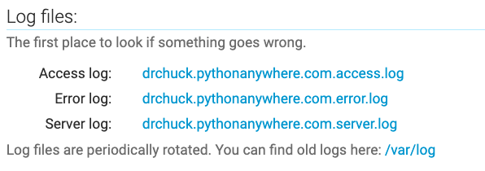

Adding HTML Content to Django
=============================

In this assignment we will be adding some HTML content to your Django instance.
Most of the content that comes from a site is usually served through a template
and a view, but sometimes you just want to have a few static HTML pages on 
your site.

*Important:* This assignment assumes you have finished the previous assignment
to setup your Django environment.  You will be adding some HTML files to your
Django environment so they are available to the autograder for grading.

Serving HTML Content
--------------------

Using the Shell on PythonAnywhere, make two folders

    mkdir ~/django_projects/mysite/site
    mkdir ~/django_projects/mysite/site/subfolder

Create a file at `~/django_projects/mysite/site/hello.txt` with the text "Hello World".

Create a file at `~/django_projects/mysite/site/subfolder/hello.html` with this text:

    <h1>Hello World</h1>

Change your `~/django_projects/mysite/mysite/urls.py` to be:

    import os
    from django.contrib import admin
    from django.urls import include, path, re_path
    from django.views.static import serve

    # Up two folders to serve "site" content
    BASE_DIR = os.path.dirname(os.path.dirname(os.path.abspath(__file__)))
    SITE_ROOT = os.path.join(BASE_DIR, 'site')

    urlpatterns = [
        path('admin/', admin.site.urls),
        path('polls/', include('polls.urls')),                                                                                           
        re_path(r'^site/(?P<path>.*)$', serve,
            {'document_root': SITE_ROOT, 'show_indexes': True},
            name='site_path'
        ),
    ]

Going forward we will be adding entries to this `urlpatterns` variable 
as we add new features.  As you do upcoming assignments,
do not remove these entries from your `urls.py`.
Just add the new url pattern entries as required by the upcoming assignments.

Once you have made the changes, you should check for errors in the PythonAnywhere shell:

    cd ~/django_projects/mysite
    python manage.py check

If the `check` fails, stop and fix any and all errors before continuing.

Once `check` succeeds, you can go to the `Web` tab on PythonAnywhere,
reload your application and then check your application by navigating to:

    (your-account).pythonanywhere.com

Viewing Your New Files
----------------------

Navigate to your top level page
page __(your-account).pythonanywhere.com__
with no path and you should see an error page
like <a href="dj4e_html/noroute.htm" target="_blank">this</a>.
This is Django's way of letting you know that you have requested a url
that has no route and so it is returning a 
<a href="https://en.wikipedia.org/wiki/HTTP_404" target="_blank">404 Not found</a> error.
But since you have `DEBUG = True` in your `settings.py` it is giving you some additional
detail which will prove very helpful to you as a developer trying to figure out why
your site is not working as you expect.

You will see the same error if you go to some random URL that does not exist like
like __(your-account).pythonanywhere.com/xyzzy__ and it should look
like <a href="dj4e_html/xyzzy.htm" target="_blank">this</a>

In a later assignment, we will add a route for the main path (i.e. no path) so users can visit your
site at the top level.

Next test the ability to serve the `site` content.

Go to __(your-account).pythonanywhere.com/site__ - you should see
see a list of files including your `hello.txt`
(like <a href="dj4e_html/site.htm" target="_blank">this</a>).
Click on `hello.txt` on your site and you should see "Hello world". 

Go to __(your-account).pythonanywhere.com/site/subfolder/hello.html__ - you should
see "Hello World" styled using a HTML header tag 
( like <a href="dj4e_html/hello.htm" target="_blank">this</a>)

Building Some Validated HTML
----------------------------

Create a web page in a file named `dj4e.htm` and store it in the `~/django_projects/mysite/site` folder according
to these specifications.

Your page will be well-formed HTML5, and indicate that it is in the UTF-8 character set.  This is a starting point
for the file.

    <!DOCTYPE html>
    <html lang="en">
    <head>
      <title>Jane Instructor 4c56ff</title>
      <meta charset="UTF-8">
    </head>
    <body>
    <h1>This is just a starting point</h1>
    
Construct your HTML following the instructions below.

      ....
    
When you have finished your HTML *and* it passes the HTML
     validator, you can submit it to the autograder.

    </body>
    </html>

Your name and code in the above HTML will come from the autograder.

* The __title__ tag must contain your name or the string indicated by the autograder.

</a>

* You must have at least one example of each of the following tags: __span__, __p__, __div__, __h1__, and __ul__

* You must have three __a__ tags and three __li__ tags.

* You must have some bold text in the document and some italics
text in the document but you must use the correct tags (i.e. neither __b__ nor __i__ are allowed).

There is a lot of flexibility within those parameters. 

But to get a grade, your HTML must have no syntax errors and must pass the validator at:

    https://validator.w3.org/nu/

</a>

Common Errors
--------------

If your application fails to 
load or reload, you might get an error message that looks
like <a href="dj4e_html/pyaw_error.htm" target="_blank">this</a>.

If you get an error, you will need to look through the error logs
under the `Web` tab on PythonAnywhere:

First check the `error` log and then check the `server` log.
Make sure to scroll through the logs to the end to find the latest error.
