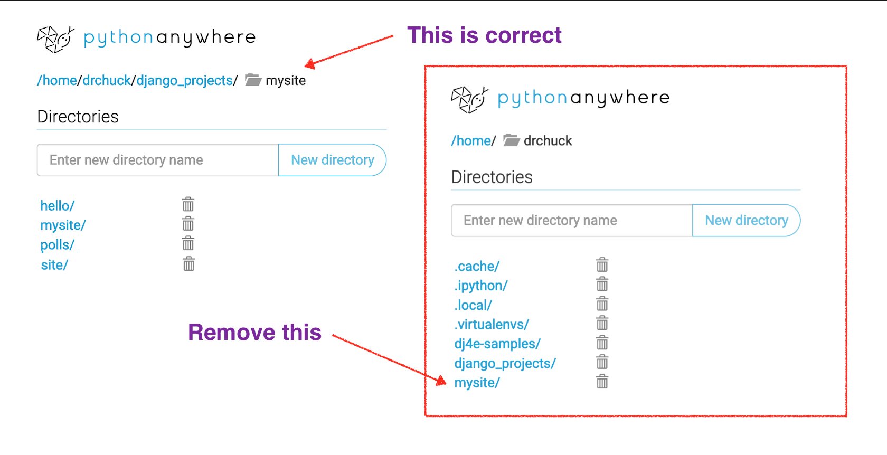

Installing Django on PythonAnywhere
===================================

Before you start this assignment, you should already have signed up for a
<a href="https://www.pythonanywhere.com" target="_blank">PythonAnywhere</a>
account and be logged in on your account.  You should be able to complete all
of the exercises in this course using a free PythonAnywhere account.

You can view a
<a href="https://www.youtube.com/watch?v=d32UKww3h1c" target="_blank">video walkthrough</a>
of this assignment.

**Note:** If you are submitting these assignments to the auto grader you
should complete each assignment and then submit it and get full credit before
moving on to the next assignment.  Because the assignments build on one another
the application that you have build by the last step of the tutorial
will no longer pass the earlier autograders.

Setting Up Your Environment
---------------------------

Once you have created your PYAW account, start a `bash` shell
and set up a virtual environment with Python 3.x and Django 3.

    mkvirtualenv django3 --python=/usr/bin/python3.8
    pip install django==3.2.5 ## this may take a couple of minutes

Note if you exit and re-start a new shell on PythonAnywhere - you need the following command
to get back into your virtual environment in the new bash shell.

    workon django3

Lets make sure that your django was installed successfully with the following command:

    python -m django --version
    # This should show something like 3.2.5

Installing the Sample Code for DJ4E
-----------------------------------

Lets also get a copy of the sample code for DJ4E checked out so you can look at sample code
as the course progresses and install some important additional Django software libraries using
`pip`.

    cd ~
    git clone https://github.com/csev/dj4e-samples
    cd dj4e-samples
    pip install -r requirements.txt
    python3 manage.py check

This is the normal output of running `check`:

    When you want to use social login, please see dj4e-samples/github_settings-dist.py
    Using registration/login.html as the login template
    System check identified no issues (0 silenced).

If you see a SyntaxError
------------------------

If the `check` identifies errors, do not go on to the rest of the assignment
once you can run `check` and there are no errors.  If you see this error:

    python manage.py check
      File "manage.py", line 17
        ) from exc
             ^
    SyntaxError: invalid syntax

Do *not* edit your `manage.py` file - the problem is never in that file.

There are several possible reasons for this:

*   It can mean that you are not running in the virtual environment (`workon django3`) and mistakenly
running Python 2 instead of Python 3.  There is *no error* in `manage.py` - it is valid
Python 3 syntax that confuses Python 2.

* It can mean that you have edited your `manage.py` file and have introduced a syntax error.  Take a look
at this <a href="dj4e_install/manage-py.png" target="_blank">screen shot of a working manage.py</a> and check if
there are any differences.   While you are there you can change line 1 from 'python' to 'python3' and the syntax
error indication will go away.  Often the mistakes are on the indentation of lines 16 and 17.  Check and match
the indentation in the screen shot exactly.

When running 'check' works
--------------------------

Once the `check` works do:

    python3 manage.py makemigrations

This is the normal output of the `makemigrations`:

    When you want to use social login, please see dj4e-samples/github_settings-dist.py
    Using registration/login.html as the login template
    No changes detected

Then run:

    python3 manage.py migrate

If you are doing this for the first time, it should run some migrations and create a file `db.sqlite3`.

The `dj4e-samples` folder is reference material that you can
use through out the course.   From time to
time we might make changes to this and ask you to do a `git pull` to get the latest version
of the code.

Building Your Application
-------------------------

Now that we have your Django set up and you have retrieved the sample code for DJ4E, lets
build your first application in the PYAW shell:

    cd ~
    mkdir django_projects
    cd django_projects
    django-admin startproject mysite

You need to edit the file `~/django_projects/mysite/mysite/settings.py` and change
the allowed hosts line (around line 28) to be:

     ALLOWED_HOSTS = [ '*' ]

Leave the __DEBUG__ value set to *True* - we are not really "in production" and if you set this to
*False* you will not see error messages when you make mistakes.

Editing Files on PythonAnywhere
-------------------------------

There are three ways to edit files in your PythonAnywhere environment, ranging from the easiest
to the coolest.  You only have to edit the file one of these ways.

(1) Go to the main PythonAnywhere dashboard, browse files, navigate to the correct folder and edit the file

    /home/drchuck/django_projects/mysite/mysite/settings.py

(2) Or in the command line:

    cd ~/django_projects/mysite/mysite/
    nano settings.py

    Save the File by pressing 'CTRL-X', 'Y', and Enter

(3) Don't try this most difficult and most cool way to edit files on Linux without a helper
if it is your first time with the `vi` text editor.

    cd ~/django_projects/mysite/mysite/
    vi settings.py

Once you have opened `vi`, cursor down to the `ALLOWED_HOSTS` line,
position your cursor between the braces and press the
`i` key to go into 'INSERT' mode, then type your new text and press the `esc` key when you are
done.  To save the file, you type `:wq` followed by `enter`.  If you get lost press `escape` `:q!`
`enter` to get out of the file without saving.

If you aleady know some _other_ command line text editor in Linux, you can use it to edit files.  In general,
you will find that it often quicker and easier to make small edits to files in the command line
rather than a full screen UI.  And once you start deploying real applications in production
environments like Google, Amazon, Microsoft, etc.. all you will have is command line.

Running Your Application
------------------------

Now that we have built your first application, we need to tell PythonAnywhere where to look
to run your application as a web server so you can test it.

In the PYAW web interface navigate to the `Web` tab to create a new web application.  You do not need
to upgrade your account - they give you one application like *drchuck.pythonanywhere.com* - use this
free application for the course.

When making the new application, do *not* create a "Django application" - instead,
select `manual configuration` and Python 3.8.  Once the webapp is created, you need to
make a few changes to the settings for the web app and your application.

    Source code: /home/drchuck/django_projects/mysite
    Working directory: /home/drchuck/django_projects/mysite

    Virtualenv: /home/drchuck/.virtualenvs/django3

Replace `drchuck` with your account on PythonAnywhere.

Note that once you have your Virtualenv set up you have a very convenient link
titled "Start a console in this virtualenv" - this is a great way to open up consoles
so you never have to type "workon django3" and it makes sure your virtual
envronment is properly set up and configured.
<a href="dj4e_install/web_tab.png" target="_blank">Sample image</a>

Then edit the *WGSI Configuration File* and put the following code into it.
__Make sure to delete the existing content__ of the *WGSI Configuration File* file and completely
replace it with the text below.
This is slightly different from the sample in the PythonAnywhere tutorial.

    import os
    import sys

    path = os.path.expanduser('~/django_projects/mysite')
    if path not in sys.path:
        sys.path.insert(0, path)
    os.environ['DJANGO_SETTINGS_MODULE'] = 'mysite.settings'
    from django.core.wsgi import get_wsgi_application
    from django.contrib.staticfiles.handlers import StaticFilesHandler
    application = StaticFilesHandler(get_wsgi_application())

Once the above configuration is complete, go back to the top of the PYAW
Web tab, `Reload` your web application, wait a few seconds and check
that it is up and running:

    http://(your-account).pythonanywhere.com/

Here is a
<a href="dj4e_install/index.htm" target="_blank">Sample</a>
of what the resulting page should look like.

Just as a note, you *never* run the `runserver` command on PythonAnywhere.

    python3 manage.py runserver

If you try to do `runserver` on PythonAnywhere it, you will see an error message like this

    00:26 ~/django_projects/mysite (master)$ python manage.py runserver
    Watching for file changes with StatReloader
    Performing system checks...
    System check identified no issues (0 silenced).
    September 14, 2021 - 00:26:16
    Django version 2.2.7, using settings 'mysite.settings'
    Starting development server at http://127.0.0.1:8000/
    Quit the server with CONTROL-C.
    Error: That port is already in use.
    00:26 ~/django_projects/mysite (master)$

This will *never* work on PythonAnywhere.  You run / restart your server on
PythonAnywhere using the "reload" button on your `Web` tab.  So
if you are reading any Django instructions that say to do a `runserver`, instead do a
`check` and then reload the application in the PythonAnywhere web UI.

Adding Your Polls Application
-----------------------------

At this point, you can add the polls application from the first Django tutorial.
We are jumping into the middle of this tutorial because
the first part of the tutorial is installing and configuring Django in general.

The first step is to make the `polls` application:

    cd ~/django_projects/mysite
    python3 manage.py startapp polls

Continue to follow the steps outlined in
<a href="https://docs.djangoproject.com/en/3.2/intro/tutorial01/#creating-the-polls-app" target="_blank">
Django tutorial</a>.
until you reach the part where the tutorial tells you to run this command:

    python3 manage.py runserver     # <-- Never run this on pythonanywhere

Do __not__ run the `runserver` command on PythonAnywhere.  Instead run the following command:

    python3 manage.py check

The `check` does a check for syntax and logic errors in your Django application.
It is easier to fix errors in the command line.

And when there are no errors, you are done with the Django Tutorial, come back to these
instructions - and navigate to the `Web` tab in Python anywhere
and `Reload` your application and then test your application by navigating to:

    (your-account).pythonanywhere.com/polls

You should see a line that looks like:

    Hello, world. You're at the polls index.

Going forward, every time we make changes to our application, we should run

    python3 manage.py check

in the shell, and when that shows no errors, navigate to the `Web`, press `Reload`,
and then go to your web site to test your changes.  This pattern of change, reload, and test
will become second nature after a while.

Possible Errors
---------------

If your application passed a `check` but fails to
load or reload, you might get an error message that looks
like <a href="dj4e_install/pyaw_error.htm" target="_blank">this</a>.

If you get an error, you will need to look through the error logs
under the `Web` tab on PythonAnywhere:

First check the `error` log and then check the `server` log.
Make sure to scroll through the logs to the end to find the most recent error.

Do you have two mysite folders?
-------------------------------

For some reason students who finish this assignment often end up making their `mysite` folder twice.
They end up with a folder in their home directory and in their `django_projects` subfolder.

It is a good idea to remove the extra folder in your home directory after making sure that the right
code is in your `django_projects/mysite` folder.   It is really frustrating to have two folders and
do a bunch of work in one of the folders that does not actually affect your running application.

So you might as well clean this up right away if you see it.

More on Your manage.py File
---------------------------

You may get lots of errors when you run `manage.py` - the errors are never
in the file itself and you will never need to edit `manage.py` to fix a problem
with your program.

Sometimes if you run

    python manage.py ....

Sometimes it even says there is a syntax error in `manage.py` like this:

    $ python manage.py check
      File "manage.py", line 16
        ) from exc
             ^
    SyntaxError: invalid syntax

This is because you are running python 2.x and not python 3.x.  The file is not
valid syntax for python2.  If you are runing python2, it probably means you are
not in the correct virtual environment.  If you check the python version:

    $ python --version
    Python 2.7.12

And it is 2.x, you have bigger problems that need to be fixed first.

If you open `manage.py` in the file editor, it will show a syntax error on line
16 - this is because it is looking at the file as Python 2 (sound familiar).
If this bothers you, you can change the first line of the file (change nothing else)
to be:

    #!/usr/bin/env python3

This is called the "Hashbang" and is a specially formatted comment that indicates what
kind of code the file contains.

And if you are reading this after you made a mistake and edited your `manage.py` - here
is a fresh copy of the file you can use:

Fresh copy of [manage.py](dj4e_install/manage.py.txt)

Django 3.x to Django 4.x issues
-------------------------------

In general Django 4.x is quite compatible with Django 3.x and Django 2.x.  You might find
small errors if you started a project on an Earlier version of Django and upgraded to
Django 4.x mid-project.  One common error is that the `url()` feature used in various `urls.py`
files changed form 3.x to 4.x.  If you see something like the following error:

    from django.conf.urls import url
    ImportError: Cannot import 'url' from 'django.conf.urls'

It is quite easy to fix.  The 'url()' function is now renamed and moves into a different
area of the Django library in 4.x.   Remove the above line and find an import from `djanjo.urls`
and add a `re_path` to it like the following:

    from django.urls import include, path, re_path
                                           ^^^^^^^ Add this

Then find lines that call `url( ..` and change them to be `re_path( ...` - the calling
patterns are the same between `url` and `re_path` so no other changes are needed.

The good news is that `re_path` also works with the Django 3.x library so once you make
the change you don't have to undo the change when going back to Django 3.x.

Here is a <a href="https://stackoverflow.com/a/71628531/1994792" target="_blank">StackOverflow answer</a>
that covers this topic.  It actually shows two ways to fix this - but the cleaner and more future-proof
approach is just changing to use `re_path` as shown above.

Starting Over Fresh
-------------------

If you have followed instructions and it just does not work and you want
to start over at the beginning of this assignment, here are the steps
to clear things out:

* Remove all of your running consoles under the www.pythonanywhere.com Consoles tab

* Open a new __bash__ console from the Consoles tab.  Do not run
the __workon__ command and run the following commands:

        cd ~
        rm -rf .virtualenvs/django3
        rm -rf dj4e-samples
        rm -rf django_projects

* Then go to the Web tab on www.pythonanywhere.com and Reload your application.
It may give you errors - this is OK.  We just want to make sure that
no processes are left hanging on to old files.

Then close your console, and delete it under the Consoles tab and go up to the very beginning
of this handout and start over.

We did not remove any of the configuration changes under the Web tab -
so as you re-create all the files, parts of the Web tab may just start
working when you Reload your application.

