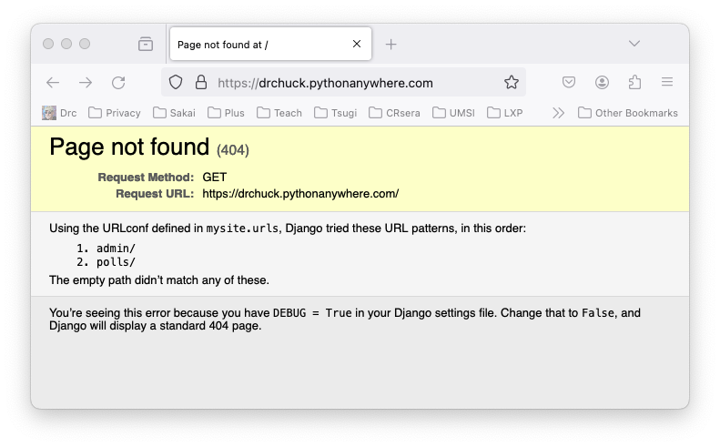

Installing Django 5.2 on PythonAnywhere
=======================================

**Note** Starting May 2025, this course is transitioning from using
Django 4.2 to Django 5.2 - If you started the course using Django 4.2 - you
can finish the course using Django 4.2 but if you are starting the course June 2025
or later, you should use Django 5.2.  If you want to use Django 4.2, please follow the
<a href="dj4e_install.md">install instructions for Django 4.2</a> to install Django 4.2.

Before you start this assignment, you should already have signed up for a
<a href="https://www.pythonanywhere.com" target="_blank">PythonAnywhere</a>
account and be logged in on your account.  You should be able to complete all
of the exercises in this course using a free PythonAnywhere account.

You can view a
<a href="https://www.youtube.com/watch?v=gefkAEEfujs" target="_blank">video walkthrough
of installing Django 5.2</a>.

Checking Your Current Virtual Environment
-----------------------------------------

Once you have created your PythonAnywhere account, start a `bash` shell under `Consoles`
and set up a virtual environment with Python 3.x and Django 5.2.  First lets
make sure you don't already have a Django 5.2 environment or other virtual environment set up.  If your
shell prompt looks as follows, you are all set up and can skip to
"Installing the Sample Code for DJ4E".

    (.ve52) 14:15 ~ $

If your prompt looks as follows, it means you have set up a Django 4.2
environment you need to either switch to and/or set up your Django 5.2 environment.

    (django42) 14:58 ~ $ 

First lets try to switch to Django 5.2 to see if it is already installed with the following
command.

    source ~/.ve52/bin/activate

If you have a Django 5.2 environment your prompt will change to look like:

    (.ve52) 14:15 ~ $

Yay, you do not need to install a virtual environment, you can skip ahead to "Installing the Sample Code for DJ4E".

Installing a Django 5.2 Virtual Environment
-------------------------------------------

If after all the above checks, you do not have a Django 5.2 virtual environment installed,
lets install one.  First lets make sure your shell has no current virtual environment
by de-activating any current virtual environment:

    cd ~
    deactivate  # May fail - this is OK

If the deactivate fails with the following message - that is OK.  You just were
not in a virtual environment:

    bash: deactivate: command not found

Now lets install a new virtual environment in your home directory (~) and check
the Python version:

    cd ~
    python -m venv .ve52
    source ~/.ve52/bin/activate
    python --version

The Python version should be at least 3.10, and is currently
3.13 or later. Once you verify your Python version is correct, run:

    pip install --upgrade pip
    pip install django==5.2 ## this may take a couple of minutes

Sometimes these two commands take a long time.  Run them one at a time in the 
shell.  When the servers are running slowly, each command can take more than ten
minutes to finish.  Be patient and wait until you see the `$` prompt indicating
the command is complete before continuing.  After they are complete, check your
Django version.

    python -m django --version

The Django version should be at least 5.2.

Note if you exit and re-start a new shell on PythonAnywhere - you need the following command
to get back into your virtual environment in the new bash shell unless you enable it automatically
as shown below.

    source ~/.ve52/bin/activate

Automatically Enabling Your Virtual Environment
-----------------------------------------------

Each time you start a new shell, you will need to activate your virtual environment.  It
is a lot simpler to do this automatically every time you login by editing the `.bashrc` file
in *your* home directory.

    /home/(your-account)/.bashrc

Go to the end of that file, add a blank line and the following lines:

    # Auto switch into Django 5.2 virtual environment
    source ~/.ve52/bin/activate

The next time you start a console/shell, the shell should be using the `.ve52` environment
and you should see the virtual environment indicator in your shell prompt:

    (.ve52) 13:29 ~ $

Installing the Sample Code for DJ4E
-----------------------------------

Lets also get a copy of the sample code for DJ4E checked out so you can look at sample code
as the course progresses and install some important additional Django software libraries using
`pip`.

    cd ~
    git clone https://github.com/csev/dj4e-samples
    cd ~/dj4e-samples
    git checkout django52
    pip install -r requirements52.txt

The `pip` command can also take a few minutes to complete.  Once it finishes and you
get the `$` prompt again, check for a good install by running:

    cd ~/dj4e-samples
    python manage.py check

This is the normal output of running `check`:

    When you want to use social login, please see dj4e-samples/github_settings-dist.py
    Using registration/login.html as the login template
    System check identified no issues (0 silenced).

If you see a SyntaxError
------------------------

If the `check` identifies errors, do not go on to the rest of the assignment
once you can run `check` and there are no errors.  If you see this error:

    python manage.py check
      File "manage.py", line 17
        ) from exc
             ^
    SyntaxError: invalid syntax

Do *not* edit your `manage.py` file - the problem is never in that file.

There are several possible reasons for this:

*   It can mean that you are not running in the virtual environment (`.ve52`) and mistakenly
running Python 2 instead of Python 3.  There is *no error* in `manage.py` - it is valid
Python 3 syntax that confuses Python 2.

* It can mean that you have edited your `manage.py` file and have introduced a syntax error.  Take a look
at this <a href="dj4e_install/manage-py.png" target="_blank">screen shot of a working manage.py</a> and check if
there are any differences.   While you are there you can change line 1 from 'python' to 'python3' and the syntax
error indication will go away.  Often the mistakes are on the indentation of lines 16 and 17.  Check and match
the indentation in the screen shot exactly.

When running 'check' works
--------------------------

Once the `check` works do:

    python manage.py makemigrations

This is the normal output of the `makemigrations`:

    When you want to use social login, please see dj4e-samples/github_settings-dist.py
    Using registration/login.html as the login template
    No changes detected

Then run:

    python manage.py migrate

If you are doing this for the first time, it should run some migrations and create a file `db.sqlite3`.

The `dj4e-samples` folder is reference material that you can use through
out the course.   From time to time we might make changes to this and ask you to
do a `git pull` to get the latest version of the code.

Building Your Application
-------------------------

Now that we have your Django set up and you have retrieved the sample 
code for DJ4E and installed required libraries, lets build your first application
in the PythonAnywhere console / bash shell:

    cd ~
    mkdir django_projects

Once you have made a folder in your home directory, lets go into that folder and make a Django project.

    cd ~/django_projects
    django-admin startproject mysite

At this point `startproject` has created a folder named `mysite` with the following files and
sub-folders.

    django_projects/
        mysite/
            manage.py
            mysite/
                __init__.py
               asgi.py
               settings.py
               urls.py
               wsgi.py

While it seems a bit counter-intuitive, there is folder called `mysite` within the folder
`mysite`.  We tend to refer to this folder as `mysite/mysite` to make sure we are talking
about the project-wide settings.  The files in this project-wide folder are have the following purposes:

* `manage.py` this is a Python script that is use to run commands to administer your
Django server.  Example `manage.py` commands we will use eventually are `check`, `createsuperuser`,
`migrate`, etc.  We never change this file.

* `mysite/settings.py` contains your overall project-wide configuration.  You set up application
loading, database connections and other global variables for your project in this file.  When you
reload your application under the `Web` tab on PythonAnywhere the `mysite/settings.py` is the first
file that PythonAnywhere reads to start your application.

* `mysite/urls.py` contains the overall URL prefix mapping.  If you look at this file, you will
see that URLs with the prefix of `/admin` are routed to the built-in Django administration screens
which we will use much later.

* `mysite/wgsi.py` and `mysite/agsi.py` are the starting points to plug our application into a hosting system
like PythonAnywhere.  We never change these files.

You only should run the `startproject` command once - it will fail if you try to run it twice.  There
are instructions to delete then entire `mysite` folder and start over at the bottom of these instructions.

At this point, keep your shell open in one tab and open the PythonAnywhere *Files* application
in another browser tab and navigate to the `~/django_projects/mysite/mysite/settings.py` and change
the allowed hosts line (around line 28) to be:

     ALLOWED_HOSTS = [ '*' ]

Leave the __DEBUG__ value set to *True* - we are not really "in production" and if you set this to
*False* you will not see error messages when you make mistakes.

Then save the file.  Do *not* "Run" the file - just save it - it will be loaded later.

Running Your Application
------------------------

Now that we have built your first application, we need to tell PythonAnywhere where to look
to run your application as a web server so you can test it.

In the PythonAnywhere web interface, navigate to the `Web` tab, and
click the `+ Add a new web app` button to create a new web
application.  You do not need to upgrade your account - they
give you one application like *drchuck.pythonanywhere.com* - use this
free application for the course.

When making the new application, do *not* create a "Django application" - instead,
select `manual configuration` and match the Python version to the version that you used in
your virtual environment above (PythonAnywhere’s latest system image currently defaults to Python 3.13).  Once the webapp is created, you need to
make a few changes to the settings for the web app and your application.

    Source code: /home/drchuck/django_projects/mysite
    Working directory: /home/drchuck/django_projects/mysite

    Virtualenv: /home/drchuck/.ve52

Replace `drchuck` with your account on PythonAnywhere.

The default Python version depends on which PythonAnywhere system image your account is using.
PythonAnywhere’s newest system image (as of March 2025) defaults to Python 3.13
(https://blog.pythonanywhere.com/219/).

Then edit the *WGSI Configuration File* and put the following code into it.
__Make sure to delete the existing content__ of the *WGSI Configuration File*
and completely replace it with the text below.
This is slightly different from the sample in the PythonAnywhere tutorial.

    import os
    import sys

    path = os.path.expanduser('~/django_projects/mysite')
    if path not in sys.path:
        sys.path.insert(0, path)
    os.environ['DJANGO_SETTINGS_MODULE'] = 'mysite.settings'
    from django.core.wsgi import get_wsgi_application
    from django.contrib.staticfiles.handlers import StaticFilesHandler
    application = StaticFilesHandler(get_wsgi_application())

Once the above configuration is complete, go back to the top of the PythonAnywhere
Web tab, `Reload` your web application, wait a few seconds and check
that it is up and visiting the URL for your application shown in in the Web
tab on PythonAnywhere like:

    http://(your-account).pythonanywhere.com/

Here is a
<a href="dj4e_install/index52.htm" target="_blank">Sample</a>
of what the resulting page should look like.

Just as a note, you *never* run the `runserver` command on PythonAnywhere.

    python manage.py runserver

If you try to do `runserver` on PythonAnywhere it, you will see an error message like this

    (.ve52) 00:10 ~/django_projects/mysite $python manage.py runserver
    Watching for file changes with StatReloader
    Performing system checks...
    System check identified no issues (0 silenced).
    Error: That port is already in use.

This will *never* work on PythonAnywhere.  You run / restart your server on
PythonAnywhere using the "reload" button on your `Web` tab.  So
if you are reading any Django instructions that say to do a `runserver`, instead do a
`check`  in the shell and then reload the application in the PythonAnywhere web UI.

Adding Your Polls Application
-----------------------------

At this point, we are going to add the polls application from the first
<a href="https://docs.djangoproject.com/en/5.2/intro/tutorial01/#creating-the-polls-app" target="_blank">
Django tutorial</a>.  The instructions below are specialized on how to do the first tutorial
specifically on PythonAnywhere.

First create the `polls` application.  A Django "project" is contains multiple Django "applications".
The `polls` application is the first of several that we will build in this course.  Each application
will be stored in its own folder under `mysite`.

    cd ~/django_projects/mysite
    python manage.py startapp polls

You should only run this command once.   It creates a new folder under `mysite` called `polls`
with the following skeleton files for your new application:

    django_projects/
        mysite/
            manage.py
            mysite/
                __init__.py
               asgi.py
               settings.py
               urls.py
               wsgi.py
             polls/
                __init__.py
                admin.py
                apps.py
                migrations
                    __init__.py
                models.py
                tests.py
                views.py

Write your first view in the `mysite/polls/views.py` file:

    from django.http import HttpResponse

    def index(request):
        return HttpResponse("Hello, world. You're at the polls index.")

Then create the `mysite/polls/urls.py` and put the following code into it:

    from django.urls import path

    from . import views

    urlpatterns = [
        path("", views.index, name="index"),
    ]

Then replace the contents of the `mysite/mysite/urls.py` as following to activate the
`mysite/polls/urls.py` file at the `/polls` URL path in your application.

    # mysite/mysite/urls.py from DJ4E

    from django.contrib import admin
    from django.urls import include, path

    urlpatterns = [
        path("polls/", include("polls.urls")),
        path("admin/", admin.site.urls),
    ]

The idea behind `include()` is to make it easy to organize the URL names across 
multiple application folders.
Since the urls "within" polls are in their own URL configuration file (`mysite/polls/urls.py`),
they can be mounted under `/polls/`, or under `/fun_polls/`, or under `/content/polls/`,
or any other path root, and the within-application poll URLs will still work relative
to that URL path root.

At this point you have created a new view (named `index`), added a route to 
the view in `mysite/polls/urls.py`, and mounted the urls for the `polls` application
into the project-wide URL routing file `mysite/mysite/urls.py`.  There are two files
named `urls.py` in two different folders.  One file is for the overall (soon to be
multi-application) project (`mysite`) and the other file is for your *first*
application (`polls`).

To see if you have made the modifications correctly, run the following commands
in a bash shell console on PythonAnywhere:

    cd ~/django_projects/mysite 
    python manage.py check

Running this command checks for syntax and logic errors in your Django application.
It is easier to fix errors in the command line.

<b>Important:</b> If you find an error, you need to stop and go back and fix the error,
running `python manage.py check` repeatedly until there are no errors.

Once there are no error, navigate to the `Web` tab in PythonAnywhere
and `Reload` your application and then test your application by navigating to:

    (your-account).pythonanywhere.com

You should see a page that looks like:

This page is a "404 Error" which means that Django could not find a route in your application for the
"empty path".  Because you have `DEBUG = true` in your `mysite/mysite/settings.py`,
Django tells you have not yet told
it how to route the "empty path" *and* it tells you all the paths it knows how to route.

This 404 error is OK at this point in the tutorial.  Later we will add a route in 
`mysite/mysite/urls.py` for the "empty path" - but for now we can change the URL to 
add `polls` to route to the application that you just created.

    (your-account).pythonanywhere.com/polls

You should see a line that looks like:

    Hello, world. You're at the polls index.

Going forward, every time we make changes to our application, we should run

    cd ~/django_projects/mysite
    python manage.py check

in the shell, and when that shows no errors, navigate to the `Web`, press `Reload`,
and then go to your web site to test your changes.  This pattern of change, check,
reload, and test will become second nature after a while.

Possible Errors
---------------

There are many possible errors you might encounter.  We have an entire page of error
recovery instructions that you might want 
to bookmark (<a href="dj4e_errors.md" target="_blank">Fixing Common Django Errors</a>)

You may want to come back to this file throughout the course when you make a small change and end
up with an error.

Editing Files on PythonAnywhere
-------------------------------

There are three ways to edit files in your PythonAnywhere environment, ranging from the easiest
to the coolest.  You only have to edit the file one of these ways.

(1) Go to the main PythonAnywhere dashboard, browse files, navigate to the correct folder and edit the file

    /home/drchuck/django_projects/mysite/mysite/settings.py

(2) Or in the command line:

    cd ~/django_projects/mysite/mysite/
    nano settings.py

    Save the File by pressing 'CTRL-X', 'Y', and Enter

(3) Don't try this most difficult and most cool way to edit files on Linux without a helper
if it is your first time with the `vi` text editor.

    cd ~/django_projects/mysite/mysite/
    vi settings.py

Once you have opened `vi`, cursor down to the `ALLOWED_HOSTS` line,
position your cursor between the braces and press the
`i` key to go into 'INSERT' mode, then type your new text and press the `esc` key when you are
done.  To save the file, you type `:wq` followed by `enter`.  If you get lost press `escape` `:q!`
`enter` to get out of the file without saving.

If you already know some _other_ command line text editor in Linux, you can use it to edit files.  In general,
you will find that it often quicker and easier to make small edits to files in the command line
rather than a full screen UI.  And once you start deploying real applications in production
environments like Google, Amazon, Microsoft, etc.. all you will have is command line.

Starting Over Fresh
-------------------

If you have followed instructions and it just does not work and you want
to start over at the beginning of this assignment, here are the steps
to clear things out:

* Remove all of your running consoles under the www.pythonanywhere.com Consoles tab

* Open a new __bash__ console from the Consoles tab.  Do not run
the __workon__ command and run the following commands:

        cd ~
        rm -rf .ve52
        rm -rf dj4e-samples
        rm -rf django_projects

* Then go to the Web tab on www.pythonanywhere.com and Reload your application.
It may give you errors - this is OK.  We just want to make sure that
no processes are left hanging on to old files.

Then close your console, and delete it under the Consoles tab and go up to the very beginning
of this handout and start over.

We did not remove any of the configuration changes under the Web tab -
so as you re-create all the files, parts of the Web tab may just start
working when you Reload your application.

