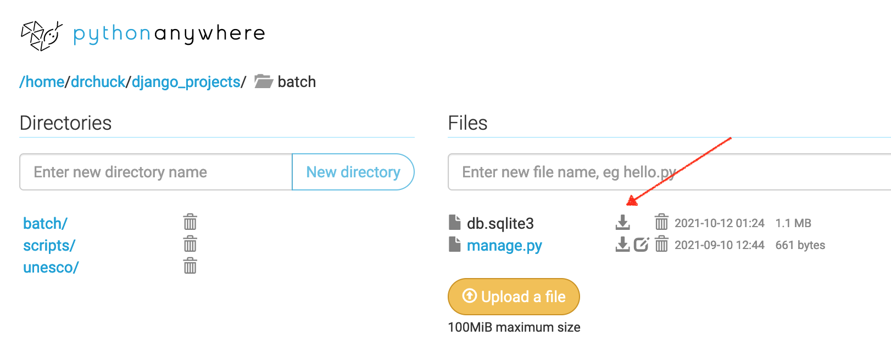

Building and Loading a Data Model
=================================

In this assignment you will temporarily step away from building the applications and
develop a data model from a file of un-normalized data and
then build a script to load data in to that model.  It is quite common to build
a web site and then need to pre-load it with data from a file or API.

The data is a simplified extraction
of the <a href="https://whc.unesco.org/en/list/" tatget="_blank">UNESCO World Heritage Sites</a> registry.
The un-normalized data is provided as both a spreadsheet and a CSV file:

<a href="dj4e_load/whc-sites-2018-clean.csv" target="_blank">CSV Version</a>

<a href="dj4e_load/whc-sites-2018-small.xls" target="_blank">XLS Version</a>

The columns in the data are as follows:

    name,description,justification,year,longitude,latitude,
    area_hectares,category,state,region,iso

You have to have the CSV data available to run the batch script.   If you are using PythonAnywhere
to do your homework, you can use the `wget` command to pull in the data (see below).

Getting Started
---------------

We will do this assignment in a new Django project called `batch` so as not to disturb your other work.

    cd ~/django_projects
    django-admin startproject batch

Make new application under your `django_projects/batch` called `unesco`.

    cd ~/django_projects/batch
    python manage.py startapp unesco

You need to copy the CSV file into the `unesco` folder.  If the `wget` command is available
you can use it to download the file:

    cd unesco
    wget https://www.dj4e.com/assn/dj4e_load/whc-sites-2018-clean.csv

Also make a folder called `scripts` and add an `__init__.py` file to it.  The `__init__.py` file
is needed in order to store Python objects in the `scripts` folder.

    cd ~/django_projects/batch
    mkdir scripts
    touch scripts/__init__.py

Make a copy of the `many_load.py` from this folder into your `scripts` folder:

https://github.com/csev/dj4e-samples/tree/main/scripts

Then in install `django extensions` if you have not already done so:

    workon django4                     # or django3 (if needed)
    pip install django_extensions

Add the following line to your `batch/batch/settings.py`:

    INSTALLED_APPS = [
        'django.contrib.admin',
        'django.contrib.auth',
        'django.contrib.contenttypes',
    ...
        'django_extensions', # Add
        'unesco.apps.UnescoConfig',  # Add
    ]

At this point you should run:

    python manage.py check

And make sure that your basic Django environment is configured properly.

Design a Data Model
-------------------

We need to design a database model that represents this flat data across
multiple tables using "third-normal form" - which basically means that
columns that have vertical duplication, such as region:

    category    state                  region                      iso

    Cultural    Afghanistan            Asia and the Pacific        af
    Cultural    Afghanistan            Asia and the Pacific        af
    Cultural    Albania                Europe and North America    al
    Cultural    Albania                Europe and North America    al
    Cultural    Algeria                Arab States                 dz
    Mixed       Algeria                Arab States                 dz
    Cultural    Algeria                Arab States                 dz
    Cultural    Algeria                Arab States                 dz

We will use a Django model that describes the tables, one-to-many relationships,
and foreign keys sufficient to represent this data efficiently with no
vertical duplication of string values.  Numbers and dates do not have to
have their own tables.

    from django.db import models

    class Category(models.Model):
        name = models.CharField(max_length=128, default="")
        def __str__(self) :
            return self.name

    class State(models.Model):
        name = models.CharField(max_length=128, default="")
        def __str__(self) :
            return self.name

    class Iso(models.Model):
        name = models.CharField(max_length=128, default="")
        def __str__(self) :
            return self.name

    class Region(models.Model):
        name = models.CharField(max_length=128, default="")
        def __str__(self) :
            return self.name

    class Site(models.Model):
        name = models.CharField(max_length=300)
        year = models.IntegerField(null=True)
        latitude = models.FloatField(null=True)
        longitude = models.FloatField(null=True)
        description = models.TextField(null=True)
        justification = models.TextField(null=True)
        area_hectares = models.FloatField(null=True)
        category = models.ForeignKey("Category", on_delete=models.CASCADE, null=True)
        region = models.ForeignKey("Region", on_delete=models.CASCADE, null=True)
        iso = models.ForeignKey("Iso", on_delete=models.CASCADE, null=True)
        state = models.ForeignKey("State", on_delete=models.CASCADE, null=True)

        def __str__(self) :
            return self.name

Draw the above data model using <a href="https://en.wikipedia.org/wiki/Entity%E2%80%93relationship_model" target="_blank">
Crow's-Foot Notation</a>. You
can use paper, or a layout tool - one way or another your
diagram should have five boxes and four lines - and the each of lines should be properly labelled
as a "many" or a "one" end.

Once you have your model built, run `makemigrations` and `migrate` to create
the database.

    cd ~/django_projects/batch
    python manage.py makemigrations
    python manage.py migrate

You can repeat the process of editing the `models.py` file and re-running the migrations steps
until you get them right.

Loading Data Into Your Database
-------------------------------

Django has a special `runscript` capability that allows you to write a Python program
to read and write the database using your Django models.

There is a simple example of how to write such a script in the
`dj4e-samples` respository:

<a href="https://github.com/csev/dj4e-samples/blob/main/many/models.py" target="_blank">Many-to-Many / Data Model</a>

<a href="https://github.com/csev/dj4e-samples/blob/main/scripts/many_load.py" target="_blank">Many-to-Many / Script</a>

See the file `load.csv` and `many_load.py` for and example of how you look through a file,
insert model data and make foreign key connections.  A key technique is in this bit of code:

    p, created = Person.objects.get_or_create(email=row[0])

This code insures that there is a row in the Person table for the email address
that was just read `row[0]`.  The email address may or may not already be in the table
from a previous line in the file. One way or another, by the end of this line
of code `p` contains a reference to a Person stored in the database that can be
used to fullfill a foreign key later in the code.

Note that the "p, created" is an example of Python function
<a href="https://youtu.be/CaVhM65wD6g?t=254" target="_blank">returning two values</a>
using a tuple.

    m = Membership(role=r,person=p, course=c)
    m.save()

The line to make the `Membership` row is the last thing that is done so all the
foreign key connections can be made.

Notice that the code empties the three tables out every time and freshly reloads
all the data so the process can be run over and over.

Dealing with Empty Columns
--------------------------

Your data will be more complex than the sample, You will need to deal with situations
where an integer column like the `year` will be empty.  First, add `null=True` to numeric columns
that can be empty in your `models.py`.   Then, before inserting the `Site` record, check the year to
see if it is a valid integer and if it is not a valid integer set it to `None` which will become
`NULL` (or empty) in the data base when inserted:

    try:
        y = int(row[3])
    except:
        y = None

    ...

    site = Site(name=row[0], description=row[1], year=y, ... )
    site.save()

You will need to do this for each of the numeric fields that might be missing or have invalid data.

Running the Script
------------------

Place the CSV file in the `unesco` folder and then run the script from the project folder (i.e.
where the `manage.py` file resides):

    cd ~/django_projects/batch
    workon django4                             # Or django3 (if necessary)
    python manage.py runscript many_load

It needs to be run this way so that lines like:

    from unesco.models import Site, Iso, ....

work properly.

Checking Your Data By Hand
--------------------------

You can also hand-check your data by running a few queries on
your data before turning it in to make sure the data makes
it into the right tables:

    $ sqlite3 db.sqlite3
    SQLite version 3.24.0 2018-06-04 14:10:15
    Enter ".help" for usage hints.
    sqlite> SELECT count(id) FROM unesco_state;
    163
    sqlite> SELECT count(id) FROM unesco_site;
    1044
    sqlite> SELECT count(id) FROM unesco_state where name="India";
    1
    sqlite> SELECT count(id) FROM unesco_site WHERE name="Hawaii Volcanoes National Park" AND year=1987 AND area_hectares = 87940.0;
    1
    sqlite> SELECT COUNT(*) FROM unesco_site JOIN unesco_iso ON iso_id=unesco_iso.id WHERE unesco_site.name="Maritime Greenwich" AND unesco_iso.name = "gb";
    1
    sqlite> .quit
    $

Upload to the Autograder
------------------------

When the data passes your manual tests, you can download `db.sqlite3` from PythonAnywhere
and then upload it to the autograder.

Resetting Your Database
-----------------------

If the autograder complains that your file is somehow too big,
or you have been changing your `models.py` and your `makemigrations`
is asking you how to convert existing columns,
or you just
want to start with a fresh database, you can run the following commands.

    $ cd ~/django_projects/batch
    $ rm db.sqlite3
    $ rm */migrations/0*
    $ python manage.py makemigrations
    $ python manage.py migrate
    $ python manage.py runscript many_load

Make sure you run these commands in the correct folder
(i.e. `~/django_projects/batch`).  You can run this process in any Django
project but your database is completely reset (i.e. admin and login accounts
are deleted as well).  This also completely rebuilds your migrations
from your latest `models.py` file(s).

