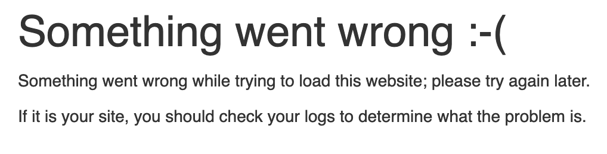
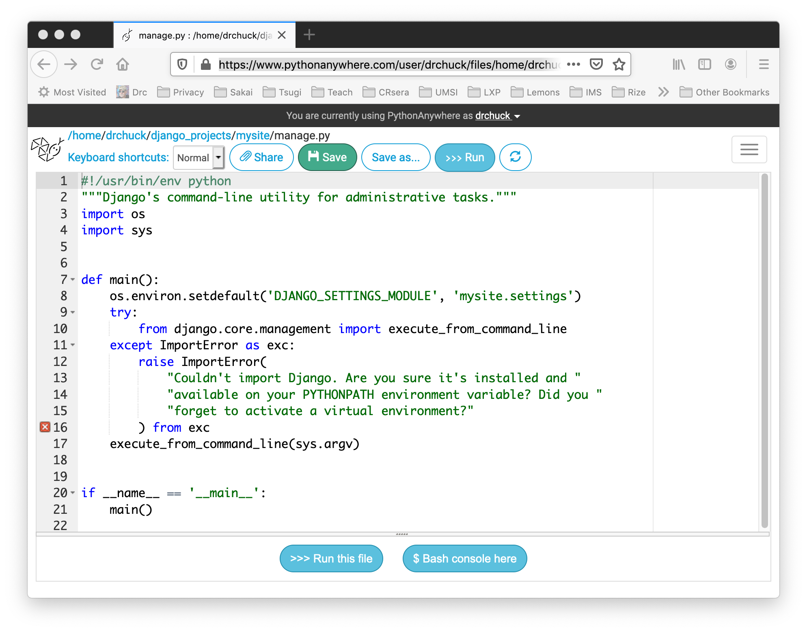

Dealing with Errors in Django Projects on Python Anywhere
=========================================================

When you get stuck on something while developing your Django Application
on PythonAnywhere this page has some possible solutions.

* When everything works but your application says 'Something went wrong :-('
* What happens when you don't activate your virtual environment (django42)
* Your line 16 seems to have a syntax error in the text editor in `manage.py`
* What to do when you see 'SyntaxError' when running `manage.py`
* What to do when the tutorial tells you to do a `python manage.py runserver`
* What to do when the tutorial tells you to access 'localhost:8000'
* How and when you exit the Django shell (>>> prompt)

When everything works but your application says 'Something went wrong :-('
--------------------------------------------------------------------------

When you have made some changes to your application and reloaded your web application
and navigate to your web page and you get an error message that says "Something went wrong :("
like this:

To fix this problem, start a console / bash shell on your account and make sure you are in your virtual
environment.  Then type these commands:

    cd ~/django_projects/mysite
    python manage.py check

This can give one of two possible outputs.  If things are going well the last line of output will be:

    System check identified no issues (0 silenced).

If there is an error, it will kbe pretty verbose:

    Traceback (most recent call last):
        File "/home/dj4e/django_projects/mysite/manage.py", line 21, in <module>
            main()
        File "/home/dj4e/django_projects/mysite/manage.py", line 17, in main
            execute_from_command_line(sys.argv)

        (About 20 more lines of traceback)

        File "/home/dj4e/django_projects/mysite/mysite/urls.py", line 20, in <module>
            path('polls/', include('pollz.urls')),
        File "/home/dj4e/.virtualenvs/django4/lib/python3.9/site-packages/django/urls/conf.py", line 38, in include
            urlconf_module = import_module(urlconf_module)
        File "/usr/local/lib/python3.9/importlib/__init__.py", line 127, in import_module
            return _bootstrap._gcd_import(name[level:], package, level)
        File "<frozen importlib._bootstrap>", line 1030, in _gcd_import
        File "<frozen importlib._bootstrap>", line 1007, in _find_and_load
        File "<frozen importlib._bootstrap>", line 972, in _find_and_load_unlocked
        File "<frozen importlib._bootstrap>", line 228, in _call_with_frames_removed
        File "<frozen importlib._bootstrap>", line 1030, in _gcd_import
        File "<frozen importlib._bootstrap>", line 1007, in _find_and_load
        File "<frozen importlib._bootstrap>", line 984, in _find_and_load_unlocked
     ModuleNotFoundError: No module named 'pollz'

This is a mess of output but you can get some clues.  The file it is upset about is `/home/dj4e/django_projects/mysite/mysite/urls.py`
and the what went wrong was that I mis-spelled `polls` as `pollz`.  

To solve this, in another tab edit the file, save it and re-run 

    python manage.py check

Until there are no errors.  Then try to reload your application and go back to the application page to see if you
there is no "Something went wrong" error any more.

If you see "Something went wrong" and `check` shows no errors
-------------------------------------------------------------

In a rare situation, `python manage.py check` shows no errors but your
application will still not load successfully.

To dig further you will need to look through the error log
under the `Web` tab on PythonAnywhere:

Load the `error` log and scroll to the very bottom to find the most
recent log error messages.  It can be quite long and take a while to get to the bottom.
When you get to the bottom, you will likely find some kind of error message.  It will likely
be a traceback and many lines long.  Most of the traceback is showing the Django files
your application is using.  So you will need to lok carefully and find where it is mentioning
a problem with something in one of your files.

This is a little tricky - so you need to be a bit of a detective to figure things out.

You *must* be in your virtual environment
---------------------------------------

If you are not in your virtual environment in a bash shell on PythonAnywhere
lots of things will fail.  You will not have access to the correct version
of Python and you will not have a proper installation of Django.  You can always
check which python you are running using the `--version` option.

In the example below we are running Python 2.7.12 (bad)
without the virtual environment and once we activate into the virtual environment we are 
using Python 3.8 and Django 3.1.

    17:33 ~ $ python --version
    Python 2.7.12
    17:33 ~ $ python -m django --version
    1.11.26
    17:33 ~ $ workon django42
    (django42) 17:33 ~ $ python --version
    Python 3.9.5
    (django42) 17:36 ~ $ python -m django --version
    4.2.7
    (django42) 17:33 ~ $ 

Each time you start a new bash shell, you need to type `workon django42`.  If you
leave and come back to a shell that is still running, if you see the '(django42)'
in your prompt - you do not have to re-run the `workon` command.  It just needs
to be done once per shell.

There are several errors that you might get if your virtual environment is
not activated:

* TypeError: argument of type 'PosixPath' is not iterable

The problem with these errors is that you think you are supposed to edit files
like `manage.py` or `settings.py` but the files are already just fine, you are
just using the wrong versions of software.

Your manage.py looks incorrect in the PythonAnywhere editor
-----------------------------------------------------------

First and most important - you should not ever change the contents of the `manage.py` file.
The file is built by Django for you and does not need to be changed.

However, if you open `manage.py` in the PythonAnywhere text editor even to look at it,
it will show a little red "X" on line 16 or 17 indicating a syntax error.

The problem (much like the virtual environment problem) is the wrong version of Python.  The text editor
is looking at the file as a Python 2.x file and not as a Python 3.x file.  So the file
<a href="dj4e_tutpaw/file-manage-py-bad.png" target="_blank">shows a syntax error</a>.

*Do not fix this error*.

If the error really bothers you, edit the first line of the file and change `python` to `python3` and save
the file.   The <a href="dj4e_tutpaw/file-manage-py-good.png" target="_blank">error will magically disappear</a>.
Do not make any other changes to the file.

If you came here after you tried to fix the syntax error and made it worse, simply
look closely at every line of <a href="dj4e_tutpaw/file-manage-py-good.png" target="_blank">the correct file</a>
and fix your file.  Usually the problem is indentation, a line has been deleted or something was moved around.

If you see a `SyntaxError` in 'manage.py' in the shell
------------------------------------------------------

If the `check` identifies errors, do not go on to the rest of the assignment 
once you can run `check` and there are no errors.  If you see this error:

    python manage.py check
      File "manage.py", line 17
        ) from exc
             ^
    SyntaxError: invalid syntax

Do *not* edit your `manage.py` file - the problem is never in that file.

There are several possible reasons for this:

* Check your virtual environment (above)
* Make sure you have not edited you `manage.py` (above)

Don't use `runserver` on PythonAnywhere
---------------------------------------

Just as a note, you *never* run the `runserver` command on PythonAnywhere.  Often the
tutorials have you make a bunch of changes to yout files and then tell you to do:

    python manage.py runserver

This functionality is replaced by the "reload" button on your Web tab.  So
if you are reading any Django instructions that say to do a `runserver`, instead do a

    python manage.py check

And then reload the application in the PythonAnywhere Web tab.  There is a short cut
to relead your application on the PythonAnywhere file editor.  It is a little icon 
in the upper right  of the editor that
reloads the application.  Usually you save the file, 
press reload and then check if your application worked.

Don't Use `localhost` URLs on PythonAnywhere
--------------------------------------------

Usually, right after the tutorial tells you to `python manage.py runserver` it
tells you to navigate to a url that looks like:

    http://127.0.0.1:8000/

Once you have reloaded your application you need to go to the URL that PythonAnywhere
has assigned to your application.

    http://(your-account).pythonanywhere.com/
    http://drchuck.pythonanywhere.com/

If the tutorial tells you to go to a URL like

    http://127.0.0.1:8000/polls

Add the `polls` to your URL.

    http://drchuck.pythonanywhere.com/polls

You do not need to add `django_projects` or `mysite` to your URL - this is all captured
in the settings under the 'Web' tab in the PythonAnywhere user interface.

How and when you exit the Django shell
-------------------------------------- 

In tutorial 2, you edit `models.py` and run the Django Shell, then you edit
the `models.py` file again and then run the shell again. What the tutorial does
not mention is the need to exit and restart the shell any time you change
`models.py`.  The tutorial tells you to run the shell again but it does not
tell you to exit the existing shell first - so you might see an error like this:

    (django42) 17:16 ~/django_projects/mysite (master)$ python manage.py shell
    Type "help", "copyright", "credits" or "license" for more information.
    (InteractiveConsole)
    >>> # Do some django shell stuff

    >>> python manage.py shell
    File "<console>", line 1
        python manage.py shell
            ^
    SyntaxError: invalid syntax
    >>> 

The correct way is to exit the shell and restart it.

    (django42) 17:20 ~/django_projects/mysite (master)$ python manage.py shell
    Type "help", "copyright", "credits" or "license" for more information.
    (InteractiveConsole)
    >>> # Do some django shell stuff

    >>> quit()
    (django42) 17:20 ~/django_projects/mysite (master)$ 

Then you edit your `models.py` and *re-start* the Django shell from the
`bash` console:

    (django42) 17:24 ~/django_projects/mysite (master)$ python manage.py shell
    Type "help", "copyright", "credits" or "license" for more information.
    (InteractiveConsole)
    >>> # Do some more django shell stuff

    >>> quit()
    (django42) 17:20 ~/django_projects/mysite (master)$ 

After a while you will understand that you need to be in `bash` (dollar sign prompt)
to run bash commands and be in the Django shell (>>> prompt) to run Django commands.
