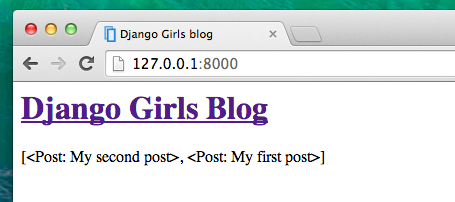
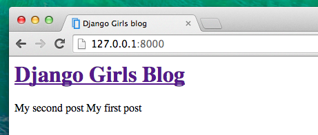
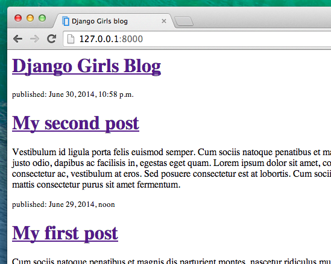
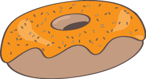

# Django templates

Time to display some data! Django gives us some helpful built-in __template tags__ for that.

## What are template tags?

You see, in HTML, you can't really write Python code, because browsers don't understand it. They know only HTML. We know that HTML is rather static, while Python is much more dynamic.

__Django template tags__ allow us to transfer Python-like things into HTML, so you can build dynamic websites faster. Cool!

## Display post list template

In the previous chapter we gave our template a list of posts in the `posts` variable. Now we will display it in HTML.

To print a variable in Django templates, we use double curly brackets with the variable's name inside, like this:

blog/templates/blog/post_list.html
```html
{{ posts }}
```

Try this in your `blog/templates/blog/post_list.html` template. Open it up in the code editor, and replace the existing `<article>` elements with `{{ posts }}`. Save the file, and refresh the page to see the results:



As you can see, all we've got is this:

```html
<QuerySet [<Post: My second post>, <Post: My first post>]>
```

This means that Django understands it as a list of objects. Remember from __Introduction to Python__ how we can display lists? Yes, with for loops! In a Django template you do them like this:

blog/templates/blog/post_list.html
```html

    {{ post }}

```

Try this in your template.  Make sure to reload your web application and refresh your browser page after every file change.



It works! But we want the posts to be displayed like the static posts we created earlier in the __Introduction to HTML__ chapter. You can mix HTML and template tags. Our `body` will look like this:

blog/templates/blog/post_list.html
```html
<header>
    <h1><a href="/">Django Girls Blog</a></h1>
</header>


    <article>
        <time>published: {{ post.published_date }}</time>
        <h2><a href="">{{ post.title }}</a></h2>
        <p>{{ post.text|linebreaksbr }}</p>
    </article>

```

Everything you put between `` and `` will be repeated for each object in the list. Refresh your page:



Have you noticed that we used a slightly different notation this time (`{{ post.title }}` or `{{ post.text }}`)? We are accessing data in each of the fields defined in our `Post` model. Also, the `|linebreaksbr` is piping the posts' text through a filter to convert line-breaks into paragraphs.

Works like a charm? We're proud! Step away from your computer for a bit – you have earned a break. :)



<div class="stop-notice">
<span class="stop-sign" aria-hidden="true">
<svg xmlns="http://www.w3.org/2000/svg" width="56" height="56" viewBox="0 0 64 64">
  <polygon points="8,4 56,4 60,16 60,48 56,60 8,60 4,48 4,16" fill="#cc0000" stroke="white" stroke-width="2"/>
  <text x="32" y="40" text-anchor="middle" font-family="sans-serif" font-size="14" font-weight="bold" fill="white">STOP</text>
</svg>
</span>
<p><strong>Note</strong> — If you are working on this tutorial as an assignment and submitting your results to an autograder, stop here and submit your work to the autograder before moving to the next step or the autograder will refuse to grade this step, as each autograder checks to see if &quot;too much&quot; has been done to ensure that you pass each interim autograder with the correct partial solution before proceeding.</p>
</div>
